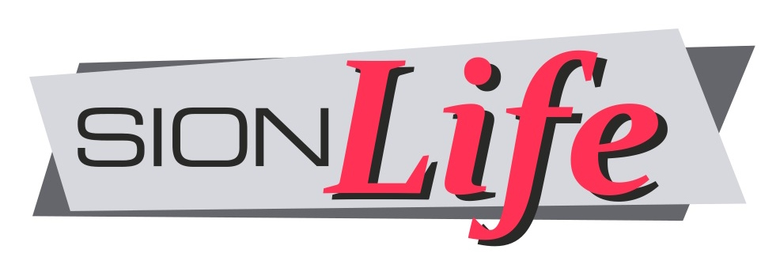

# sionLife Project Overview
### created by Richard Bogad (c) 2013

  
  

## Project Overview:
Building on the success of the sionChicken project, sionLife aimed to enhance the simulation of diverse life forms through a modular approach. This project featured cutting-edge technologies, including automated 3D printing for custom life forms, abstract modular brain definitions for easy personality shaping, and virtual genes influencing appearance and behavior. A key innovation was its fully automated auction system for trading bred life forms, fostering a robust and secure trading environment. Continuous development and autonomous troubleshooting were supported by a sophisticated copy protection system, addressing Second Life's existing licensing limitations. A dedicated community forum was established to encourage user engagement and networking.

## Technical Implementation:
The project was divided between the Second Life client and external servers, managed centrally via Google App Engine. A dedicated website provided user access to information and control mechanisms. An innovative verification system served as copy protection, unlocking products post-transaction. Efficiency was enhanced through caching and automated maintenance routines, reducing Google App Engine costs. External logic allowed for control of Second Life objects beyond the game, offering a seamless integration between virtual and real-world interactions.

## Project Development:
Programming began in April 2013 but faced challenges with the announcement of Second Life 2 by Linden Labs in June 2014, which was incompatible with the original version, leading to a decline in users. Despite these obstacles, the project was completed in February 2015, gradually growing a dedicated community. By June 2015, the decision was made not to further develop the project due to the evolving virtual environment landscape.

## Technological Foundation:
sionLife stood out for its modular design, allowing for versatile applications in future projects. Its high technical reliability and maintenance-free operation significantly reduced oversight requirements. The user interface, based on GWT, required only a browser without additional software installations. Dynamic instance assignments facilitated global web services or apps integration. Automated 3D printing and model delivery were executed through i.Materialise, with rendering capabilities enabling 3D display directly in the browser.

 
\pagebreak 

## Project sionLife Impressions

  

  
  

  
  
  
  

## Links
[sionLife announcement](https://github.com/richardbogad/sionLife/blob/main/various/sionLife.pdf)

### License

sionLife © 2014 by Richard Bogad is licensed under CC BY-NC-SA 4.0.
To view a copy of this license, visit http://creativecommons.org/licenses/by-nc-sa/4.0/ or [CC BY-NC-SA 4.0](license.txt)
